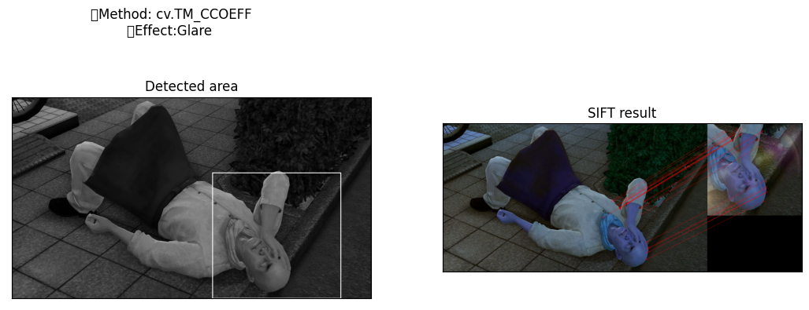
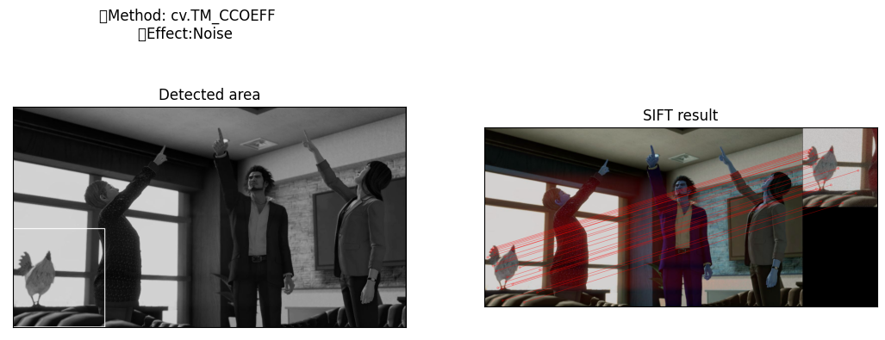
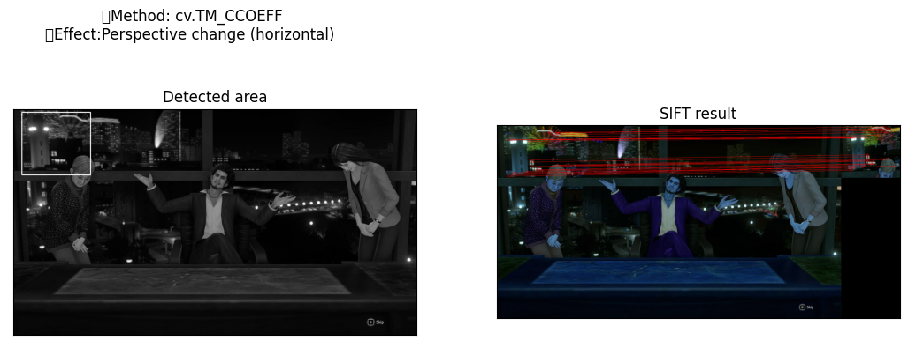
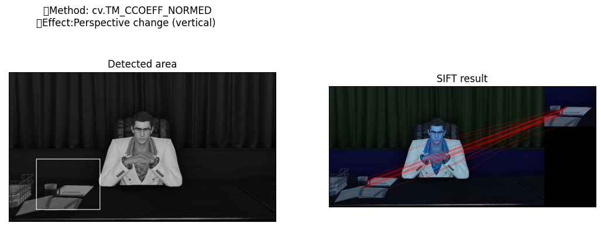

# Лабораторная работа №2

## 

## Цель работы
Исследовать простейшие алгоритмы детектирования объектов на изображении.

## Задание
  1. Реализовать программу согласно описанию. Можно использовать языки C++ или Python и любые библиотеки, при этом необходимо чтобы вся задача не решалась только с помощью одной встроенной функции (например, lib.detect_template(image, template).
  2.  Сравнить качество работы двух вариантов реализации по точности детектирования.
  3. Сделать отчёт в виде readme на GitHub, там же должен быть выложен исходный код.

## Описание
  Необходимо реализовать два примитивных детектора объектов на изображении, работающих с помощью поиска эталона на входном изображении.
  1. Прямой поиск одного изображения на другом (template matching)
  2. Поиск ключевых точек эталона на входном изображении (например, с помощью SIFT, ORB..)

Программа должна принимать на вход два изображения, эталон и то, на котором будет производиться поиск. На выходе программа должна строить рамку в виде четырехугольника в области, где с наибольшей вероятностью находится искомый объект. Необходимо протестировать оба варианта программы на разных изображениях (например, сначала в качестве эталона использовать вырезанный фрагмент входного изображения, а затем изображение какого-либо предмета сцены, присутствующего на входном изображении, но сфотографированного с другого ракурса или с другим освещением), не менее 10 тестовых примеров.

## Теория
Template matching — метод, основанный на нахождении места на изображении, наиболее похожем на шаблон. “Похожесть” изображения задается определенной метрикой. То есть, шаблон "накладывается" на изображение, и считается расхождение между изображением и и шаблоном. Положение шаблона, при котором это расхождение будет минимальным, и будет означать место искомого объекта.

В качестве метрики можно использовать разные варианты, например — сумма квадратов разниц между шаблоном и картинкой (sum of squared differences, SSD), или использовать кросс-корреляцию (cross-correlation, CCORR).

Для детектирования используются:
 - CV_TM_SQDIFF — сумма квадратов разниц значений пикселей
 - CV_TM_SQDIFF_NORMED — сумма квадрат разниц цветов, отнормированная в диапазон 0..1.
 - CV_TM_CCORR — сумма поэлементных произведений шаблона и сегмента картинки
 - CV_TM_CCORR_NORMED — сумма поэлементных произведений, отнормированное в диапазон -1..1.
 - CV_TM_CCOEFF — кросс-коррелация изображений без среднего
 - CV_TM_CCOEFF_NORMED — кросс-корреляция между изображениями без среднего, отнормированная в -1..1 (корреляция Пирсона)

## Приимер выполнения программы:

## Вывод:
Исследованны простейшие алгоритмы детектирования объектов на изображении. В некоторых вариантах неверно определены границы искомого объекта. С учётом произведения нескольких экспериментов были замечены как погрешности в определении горизонтальной перспективы, так и при добавлении шума. Но данный момент можно списать на высокую детализацию выбраных изображений. 
